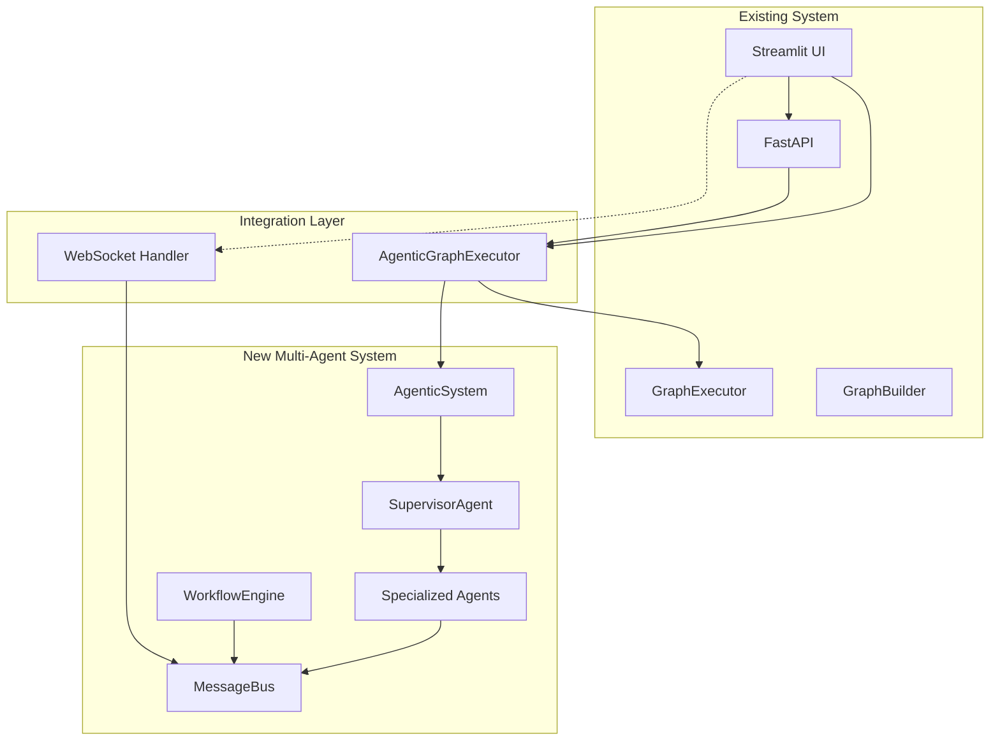

# DevPilot Integration Plan - Phase 2

## Overview

This document outlines the plan to integrate the new multi-agent system with the existing Streamlit UI and FastAPI backend.

## Integration Architecture



## Integration Components

### 2.1 AgenticGraphExecutor

A bridge class that provides the same interface as `GraphExecutor` but uses the new `AgenticSystem` under the hood.

**Location**: `src/dev_pilot/graph/agentic_executor.py`

**Key Features**:
- Compatible with existing `GraphExecutor` interface
- Delegates to `AgenticSystem` for agent-based execution
- Fallback to legacy `GraphExecutor` if needed
- State mapping between old and new formats

**Interface**:
```python
class AgenticGraphExecutor:
    def __init__: llm, use_agents: bool = True
    def start_workflow: project_name -> dict
    def generate_stories: task_id, requirements -> dict
    def graph_review_flow: task_id, status, feedback, review_type -> dict
    def get_updated_state: task_id -> dict
    def get_agent_status: -> dict  # New method
```

### 2.2 FastAPI Updates

**Location**: `src/dev_pilot/api/fastapi_app.py`

**Changes**:
1. Update `groq_models` list - remove deprecated `gemma2-9b-it`
2. Add `AgenticSystem` initialization in lifespan
3. Add new endpoints for agent operations
4. Add WebSocket endpoint for real-time updates

**New Endpoints**:
```
GET  /api/v2/agents/status       - Get all agent status
GET  /api/v2/agents/{agent_id}   - Get specific agent status
POST /api/v2/projects            - Create project with agents
GET  /api/v2/projects/{id}/status - Get project workflow status
POST /api/v2/projects/{id}/approve - Approve current stage
POST /api/v2/projects/{id}/reject  - Reject with feedback
WS   /ws/agents                  - WebSocket for real-time updates
```

### 2.3 Streamlit UI Updates

**Location**: `src/dev_pilot/ui/streamlit_ui/streamlit_app.py`

**Changes**:
1. Add toggle to switch between legacy and agentic mode
2. Replace `GraphExecutor` with `AgenticGraphExecutor`
3. Add agent status sidebar component
4. Add real-time progress indicators

**New UI Components**:
- Agent activity panel in sidebar
- Current agent indicator per tab
- Progress bar with agent names
- Real-time log viewer optional

### 2.4 Agent Status Dashboard

**New Tab**: Add Agent Dashboard tab showing:
- All active agents with status
- Current task assignments
- Message flow visualization
- Workflow progress timeline

### 2.5 State Mapping

Map between old `SDLCState` and new `ProjectContext`:

| Old State Field | New Context Field |
|----------------|-------------------|
| `project_name` | `project_name` |
| `requirements` | `requirements` |
| `user_stories` | `artifacts.user_stories` |
| `design_documents` | `artifacts.design_docs` |
| `code_generated` | `artifacts.code` |
| `security_recommendations` | `artifacts.security_review` |
| `test_cases` | `artifacts.test_cases` |
| `qa_testing_comments` | `artifacts.qa_results` |
| `deployment_feedback` | `artifacts.deployment` |

## Implementation Order

1. **AgenticGraphExecutor** - Core bridge class
2. **FastAPI model fix** - Quick fix for deprecated model
3. **FastAPI new endpoints** - Add v2 agent API
4. **Streamlit integration** - Update UI to use new executor
5. **Agent dashboard** - Add visibility component
6. **Testing** - Integration tests

## Backward Compatibility

The integration maintains full backward compatibility:
- Existing API endpoints continue to work
- UI can toggle between legacy and agentic mode
- State format is automatically converted
- No breaking changes to external interfaces

## Testing Strategy

1. **Unit Tests**: Test state mapping and conversion
2. **Integration Tests**: Test full workflow with agents
3. **E2E Tests**: Test Streamlit UI with both modes
4. **Performance Tests**: Compare execution time

## Risk Mitigation

| Risk | Mitigation |
|------|------------|
| Agent failures | Fallback to legacy GraphExecutor |
| State inconsistency | Validation layer in AgenticGraphExecutor |
| Performance regression | Async execution and caching |
| UI responsiveness | WebSocket for non-blocking updates |
