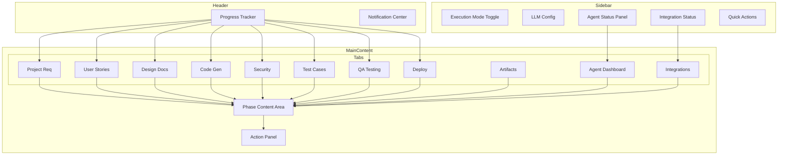

# DevPilot UI Enhancement Plan

## Executive Summary

This document outlines a comprehensive plan to enhance the DevPilot Streamlit UI, focusing on improved visual design, better progress visualization, real-time agent status monitoring, and enhanced user experience across all SDLC phases and integrations.

---

## Current State Analysis

### Existing UI Structure
- **11 Tabs**: Project Requirement, User Stories, Design Documents, Code Generation, Test Cases, QA Testing, Deployment, Download Artifacts, Agent Dashboard, Integrations, Live Execution Sandbox
- **Sidebar**: LLM selection, API key input, execution mode toggle, workflow overview image
- **Styling**: Two CSS files with glassmorphism and gradient styling

### Current Limitations
1. Static progress visualization - no clear indication of current phase
2. Agent Dashboard shows basic metrics but lacks real-time updates
3. Integrations tab has forms but limited feedback on connection status
4. No visual workflow navigation
5. Limited notification system for stage transitions
6. CSS not fully utilized in the Streamlit components
7. Artifacts tab lacks preview functionality

---

## UI Enhancement Architecture

```
┌─────────────────────────────────────────────────────────────────────────────────┐
│                              Enhanced DevPilot UI                                │
├─────────────────────────────────────────────────────────────────────────────────┤
│  ┌────────────────────────────────────────────────────────────────────────────┐ │
│  │                        Header with Progress Tracker                         │ │
│  │  ┌──────┐ ┌──────┐ ┌──────┐ ┌──────┐ ┌──────┐ ┌──────┐ ┌──────┐ ┌──────┐   │ │
│  │  │ Req  │─│Story │─│Design│─│ Code │─│ Sec  │─│ Test │─│  QA  │─│Deploy│   │ │
│  │  │  ✓   │ │  ✓   │ │  ●   │ │  ○   │ │  ○   │ │  ○   │ │  ○   │ │  ○   │   │ │
│  │  └──────┘ └──────┘ └──────┘ └──────┘ └──────┘ └──────┘ └──────┘ └──────┘   │ │
│  └────────────────────────────────────────────────────────────────────────────┘ │
│                                                                                  │
│  ┌───────────────┐  ┌──────────────────────────────────────────────────────────┐│
│  │    Sidebar    │  │                    Main Content Area                      ││
│  │               │  │  ┌────────────────────────────────────────────────────┐  ││
│  │  LLM Config   │  │  │              Current Phase Content                 │  ││
│  │  ────────────  │  │  │                                                    │  ││
│  │  Agent Status │  │  │  - Phase-specific forms                            │  ││
│  │  ────────────  │  │  │  - Generated content display                      │  ││
│  │  ┌──────────┐ │  │  │  - Review and feedback controls                    │  ││
│  │  │Supervisor│ │  │  │  - Artifact preview                                │  ││
│  │  │   🟢     │ │  │  │                                                    │  ││
│  │  │BA Agent  │ │  │  └────────────────────────────────────────────────────┘  ││
│  │  │   🔵     │ │  │                                                          ││
│  │  │Developer │ │  │  ┌────────────────────────────────────────────────────┐  ││
│  │  │   ⚪     │ │  │  │              Action Panel                          │  ││
│  │  └──────────┘ │  │  │  ┌─────────┐  ┌─────────┐  ┌─────────────────────┐ │  ││
│  │               │  │  │  │Approve ✓│  │Feedback │  │ Previous | Next ▶  │ │  ││
│  │  Integrations │  │  │  └─────────┘  └─────────┘  └─────────────────────┘ │  ││
│  │  ────────────  │  │  └────────────────────────────────────────────────────┘  ││
│  │  Slack    🟢  │  │                                                          ││
│  │  Jira     🔴  │  └──────────────────────────────────────────────────────────┘│
│  │  GitHub   🔴  │                                                               │
│  │               │                                                               │
│  │  Quick Actions│                                                               │
│  │  ────────────  │                                                               │
│  │  🔄 Reset     │                                                               │
│  │  📥 Export    │                                                               │
│  └───────────────┘                                                               │
└─────────────────────────────────────────────────────────────────────────────────┘
```

---

## Component Specifications

### 1. Visual Progress Tracker

**Purpose**: Show clear progress through SDLC phases with visual indicators

**Features**:
- Horizontal stepper with 8 phases
- Status indicators: ✓ Completed, ● Current, ○ Pending, ⚠ Needs Attention
- Clickable nodes for navigation between phases
- Animated transitions between states
- Tooltip with phase details on hover

**Implementation**:
```python
def render_progress_tracker:
    phases = [
        - name: Requirements, icon: 📋, stage: REQUIREMENT_COLLECTION
        - name: User Stories, icon: 📖, stage: GENERATE_USER_STORIES
        - name: Design, icon: 🏗️, stage: CREATE_DESIGN_DOC
        - name: Code, icon: 💻, stage: CODE_GENERATION
        - name: Security, icon: 🔒, stage: SECURITY_REVIEW
        - name: Testing, icon: 🧪, stage: WRITE_TEST_CASES
        - name: QA, icon: ✅, stage: QA_TESTING
        - name: Deploy, icon: 🚀, stage: DEPLOYMENT
    ]
```

### 2. Enhanced Sidebar

**Purpose**: Provide quick access to key information and controls

**Sections**:
1. **Execution Mode Toggle** - Agent vs Legacy mode
2. **LLM Configuration** - Model selection with validation
3. **Agent Status Panel** - Real-time agent states
4. **Integration Status** - Quick view of connected services
5. **Quick Actions** - Reset, Export, Help
6. **Workflow Mini-map** - Condensed workflow image

**Agent Status Panel Design**:
```
┌─────────────────────────┐
│ 🤖 Active Agents        │
├─────────────────────────┤
│ ▓▓▓▓ Supervisor   🟢   │
│ ▓▓░░ BA Agent     🔵   │
│ ░░░░ Architect    ⚪   │
│ ░░░░ Developer    ⚪   │
│ ░░░░ Security     ⚪   │
│ ░░░░ QA           ⚪   │
│ ░░░░ DevOps       ⚪   │
└─────────────────────────┘
Legend: 🟢 Active 🔵 Working ⚪ Idle 🔴 Error
```

### 3. Agent Dashboard Enhancements

**Purpose**: Comprehensive view of multi-agent system status

**Features**:
1. **System Health Overview**
   - Total agents registered
   - Active/Idle/Error counts
   - Message bus metrics
   - Task queue status

2. **Agent Cards**
   - Individual agent status with expandable details
   - Task completion metrics
   - Current task indicator
   - Performance graphs optional

3. **Workflow Timeline**
   - Visual timeline of agent activities
   - Time-based view of phase transitions
   - Clickable events for details

4. **Live Activity Feed**
   - Real-time log of agent activities
   - Filterable by agent type
   - Color-coded by event type

**Agent Card Layout**:
```
┌─────────────────────────────────────────┐
│ 📋 Business Analyst Agent               │
├─────────────────────────────────────────┤
│ Status: 🔵 Working                      │
│ Current Task: Generating User Stories   │
│                                         │
│ Tasks:  ✓ 5  ⚠ 1  ✗ 0                  │
│ Messages Sent: 12                       │
│                                         │
│ ▓▓▓▓▓▓▓▓░░ 80% Complete                │
└─────────────────────────────────────────┘
```

### 4. Integrations Tab Improvements

**Purpose**: Functional integration configuration with real feedback

**Features**:
1. **Connection Testing**
   - Test Connection button for each integration
   - Real-time connection status indicator
   - Error messages with troubleshooting hints

2. **Integration Cards**
   - Visual cards instead of nested tabs
   - Quick toggle on/off
   - Last sync timestamp
   - Event count metrics

3. **Event Log**
   - Recent events sent to each integration
   - Success/failure status
   - Payload preview

4. **Configuration Wizard**
   - Step-by-step setup for each integration
   - Validation feedback
   - Help tooltips

**Integration Card Design**:
```
┌─────────────────────────────────────────┐
│ 💬 Slack                         🟢 ON │
├─────────────────────────────────────────┤
│ Channel: #devpilot                      │
│ Last Event: 2 minutes ago               │
│ Events Sent: 24  Success Rate: 100%     │
│                                         │
│ ┌─────────┐ ┌─────────┐ ┌───────────┐  │
│ │Configure│ │  Test   │ │ View Logs │  │
│ └─────────┘ └─────────┘ └───────────┘  │
└─────────────────────────────────────────┘
```

### 5. Artifact Preview and Download

**Purpose**: Better visualization and access to generated artifacts

**Features**:
1. **Markdown Rendering**
   - Proper markdown preview with syntax highlighting
   - Code blocks with copy button
   - Collapsible sections

2. **Code Preview**
   - Syntax-highlighted code display
   - File tree navigation for multi-file outputs
   - Diff view for revisions

3. **Export Options**
   - Download individual artifacts
   - Download all as ZIP
   - Export to GitHub via integration

4. **Version History**
   - Track artifact revisions
   - Compare versions
   - Restore previous versions

### 6. Notification System

**Purpose**: Keep users informed of stage transitions and important events

**Features**:
1. **Toast Notifications**
   - Non-blocking notifications for events
   - Success, Warning, Error, Info types
   - Auto-dismiss with configurable duration

2. **Notification Center**
   - Bell icon in header with unread count
   - List of recent notifications
   - Mark as read functionality

3. **Stage Transition Alerts**
   - Modal or prominent alert when stage changes
   - Clear call-to-action for next steps
   - Summary of completed work

### 7. Visual Workflow Graph

**Purpose**: Interactive visualization of SDLC workflow

**Features**:
1. **Interactive Graph**
   - Clickable nodes to navigate to phases
   - Edges showing workflow direction
   - Current position highlighted

2. **Status Overlay**
   - Color-coded nodes by status
   - Animated current node
   - Tooltip with phase details

3. **Zoom and Pan**
   - Zoom controls for large workflows
   - Pan to navigate
   - Reset view button

---

## CSS Enhancements

### New Styling Components

```css
/* Progress Tracker */
.progress-tracker {
    display: flex;
    justify-content: space-between;
    align-items: center;
    padding: 1rem 2rem;
    background: rgba(255, 255, 255, 0.95);
    border-radius: 15px;
    box-shadow: 0 4px 20px rgba(0, 0, 0, 0.08);
    margin-bottom: 2rem;
}

.progress-step {
    display: flex;
    flex-direction: column;
    align-items: center;
    position: relative;
}

.progress-step.completed .step-icon {
    background: linear-gradient(135deg, #48bb78 0%, #38a169 100%);
    color: white;
}

.progress-step.current .step-icon {
    background: linear-gradient(135deg, #0062E6 0%, #33A9FF 100%);
    color: white;
    animation: pulse 2s infinite;
}

.progress-step.pending .step-icon {
    background: #e2e8f0;
    color: #a0aec0;
}

/* Agent Status Cards */
.agent-card {
    background: white;
    border-radius: 12px;
    padding: 1.25rem;
    box-shadow: 0 2px 8px rgba(0, 0, 0, 0.06);
    border-left: 4px solid #0062E6;
    transition: transform 0.2s ease;
}

.agent-card:hover {
    transform: translateX(5px);
}

.agent-card.working {
    border-left-color: #3182ce;
}

.agent-card.idle {
    border-left-color: #a0aec0;
}

.agent-card.error {
    border-left-color: #e53e3e;
}

/* Integration Cards */
.integration-card {
    background: linear-gradient(145deg, #ffffff 0%, #f7fafc 100%);
    border-radius: 12px;
    padding: 1.5rem;
    box-shadow: 0 4px 15px rgba(0, 0, 0, 0.05);
    transition: all 0.3s ease;
}

.integration-card.connected {
    border: 2px solid #48bb78;
}

.integration-card.disconnected {
    border: 2px solid #e2e8f0;
}

/* Notification Toast */
.toast-notification {
    position: fixed;
    top: 20px;
    right: 20px;
    padding: 1rem 1.5rem;
    border-radius: 10px;
    background: white;
    box-shadow: 0 10px 40px rgba(0, 0, 0, 0.15);
    animation: slideInRight 0.3s ease;
    z-index: 1000;
}

@keyframes slideInRight {
    from {
        opacity: 0;
        transform: translateX(100px);
    }
    to {
        opacity: 1;
        transform: translateX(0);
    }
}

/* Dark Mode Support */
@media (prefers-color-scheme: dark) {
    .stApp {
        background: linear-gradient(135deg, #1a202c 0%, #2d3748 100%);
    }
    
    .progress-tracker,
    .agent-card,
    .integration-card {
        background: #2d3748;
        color: #e2e8f0;
    }
}
```

---

## Component Library Structure

```
src/dev_pilot/ui/
├── streamlit_ui/
│   ├── streamlit_app.py          # Main app - enhanced
│   ├── advanced_style.css        # Enhanced CSS
│   ├── custom.css                # Custom components CSS
│   └── components/               # NEW: Reusable components
│       ├── __init__.py
│       ├── progress_tracker.py   # Progress stepper component
│       ├── agent_status.py       # Agent status display
│       ├── integration_card.py   # Integration card component
│       ├── artifact_viewer.py    # Artifact preview component
│       ├── notification.py       # Toast notification system
│       ├── workflow_graph.py     # Interactive workflow viz
│       └── theme.py              # Theme and styling utilities
```

---

## Implementation Phases

### Phase 1: Core Visual Enhancements
- Progress tracker component
- Enhanced sidebar with agent status
- Updated CSS styling
- Responsive layout improvements

### Phase 2: Agent Dashboard Upgrade
- Real-time agent status cards
- Activity timeline
- Performance metrics display
- Live activity feed

### Phase 3: Integrations Improvements
- Integration status cards
- Connection testing functionality
- Event logging display
- Configuration wizard

### Phase 4: Artifact and Workflow
- Markdown/code preview improvements
- Version history for artifacts
- Interactive workflow graph
- Export enhancements

### Phase 5: Polish and UX
- Notification system
- Dark mode support
- Accessibility improvements
- Performance optimization

---

## Technical Considerations

### Streamlit Limitations and Workarounds

1. **Real-time Updates**
   - Use `st.experimental_rerun` with careful state management
   - Implement periodic refresh using `st_autorefresh` from streamlit-autorefresh package
   - Consider WebSocket integration for true real-time updates

2. **Custom Components**
   - Use `st.components.v1.html` for custom HTML/CSS/JS
   - Create Streamlit custom components for complex visualizations
   - Leverage existing packages like `streamlit-option-menu`, `streamlit-aggrid`

3. **State Management**
   - Enhance session state structure for UI state
   - Add state persistence across page refreshes
   - Implement undo/redo for feedback iterations

4. **Styling**
   - Use `st.markdown` with unsafe_allow_html for custom styling
   - Inject CSS via `st.markdown(<style>...</style>)`
   - Create utility functions for consistent styling

### Dependencies to Add

```txt
# UI Enhancement Dependencies
streamlit-option-menu>=0.3.6
streamlit-aggrid>=0.3.4
streamlit-extras>=0.3.0
streamlit-autorefresh>=0.0.1
streamlit-mermaid>=0.0.2
plotly>=5.18.0
streamlit-lottie>=0.0.5
```

---

## Success Metrics

| Metric | Target |
|--------|--------|
| Page Load Time | < 2 seconds |
| User Task Completion Rate | > 90% |
| Error Recovery Rate | > 85% |
| Mobile Responsiveness | Tablet + Desktop |
| Accessibility Score | WCAG 2.1 AA |

---

## Mermaid Diagram: Enhanced UI Flow



---

## Next Steps

1. Review and approve this plan
2. Switch to Code mode for implementation
3. Start with Phase 1: Core Visual Enhancements
4. Iterate based on feedback

---

*Plan created: December 20, 2024*
*Author: DevPilot Architecture Team*
